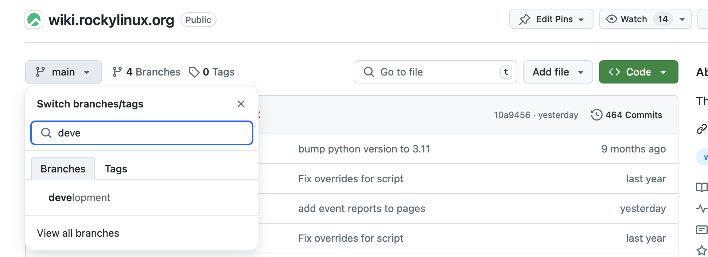

# Contributing Guide

Thank you for your interest in contributing to the Rocky Linux wiki! Below is a guide to help you get started with your contributions.

**Prerequisites**

Before contributing, ensure you have a basic understanding of the following:

* **Git:** Knowledge of Git workflows is essential since all our code management is done through Git.

**Development Environment**

1. **Fork and Clone:** Start by forking the repository and then cloning your fork locally.
2. **Branch:** Always create a new branch from `development` for your work. The `development` branch is our main development branch, and all PRs should target this branch.

**Issue-Driven Development**

* **Find or Create an Issue:** Before starting work on a change, please search for an existing issue.  If no issue addresses your proposed changes, create a new issue to document the problem or potential enhancement.
* **Link Your PR:** When you open your pull request, clearly link it to the associated issue. This helps maintainers understand the context of your changes.

**Coding Guidelines**

This is a low-code repository.
* **Code Style:** Follow a similar writing style to the rest of the document or to other documents in the repository.
* **Components:** Utilize existing UI components from shadcn/ui where possible. If you need to create new components, ensure they are reusable and well-documented.

**Adding Images**

* **Location:** All images should be placed in the `docs/assets/images` directory. Please categorize images by their purpose.
* **Optimization:** Ensure that images are optimized for the web to enhance performance and reduce load times.
Best practices include the following:
  * .jpeg for photos, vector .svg for icons and diagrams;
  * 150kb or smaller for typical hero/blog/social media images that would go in a post.
  * Suggested image standards for 2024, as found on [tiny-img.com](https://tiny-img.com/blog/best-image-size-for-website/):
 
    | Website Image Type	| Image Dimensions (W x H) | Image Aspect Ratio |
    | ---| --- | --- |
    | Background Image	| 1920 x 1080 pixels |	16:9 |
    | Hero Image	| 1280 x 720 pixels	| 16:9 |
    | Website Banner	| 250 x 250 pixels	| 1:1 |
    | Blog Image	| 1200 x 630 pixels	| 3:2 |
    | Logo (Rectangle)	| 250 x 100 pixels	| 2:3 |
    | Logo (Square)	| 100 x 100 pixels	| 1:1 |
    | Favicon	| 16 x 16 pixels	| 1:1 |
    | Social Media Icons	| 32 x 32 pixels	| 1:1 |
    | Lightbox Images (Full Screen)	| 1600 x 500 pixels	| 16:9 |
    | Thumbnail Image	| 150 x 150 pixels	| 1:1 |

**Translation Contributions**

This wiki is not currently set up for translation, but we welcome your energy to create that momentum. If you have interest in translation, please visit our [Documentation Team](https://chat.rockylinux.org/rocky-linux/channels/documentation) on the Mattermost server and ask to join the localization conversation.

**Pull Request Process**

1. **Pull Request:** Once you are ready, open a pull request against the `develop` branch. Ensure that your PR title and description clearly describe the changes, and **reference the associated issue number (e.g., "Fixes #123")**.
2. **Review:** Your pull request will be reviewed by maintainers. Be responsive to feedback and make necessary adjustments based on the review.
3. **Merge:** Once your PR is approved and passes all checks, a maintainer will merge it into the `develop` branch.

**Testing**

Before submitting your pull request, ensure that all existing tests pass and add new tests if you are introducing new features or significant changes.

**Getting Help**

For questions or assistance with your contributions, please reach out via our [Mattermost server](https://chat.rockylinux.org/rocky-linux/channels/off-topic). 

We appreciate your contributions and look forward to improving the Rocky Linux wiki together!
